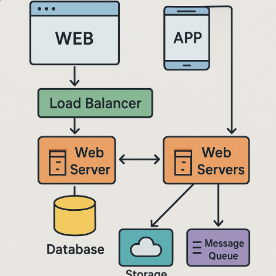

# 第1章：基礎知識

この章では、基礎知識について解説します。

## 1.1 基本概念

ここでは、この技術の基本的な概念について説明します。

### 1.1.1 用語の定義

重要な用語とその定義を以下に示します：

- **用語A**: これは重要な概念Aを指します。
- **用語B**: これは重要な概念Bを表します。
- **用語C**: これは技術Cを意味します。

### 1.1.2 歴史的背景

この技術の歴史的な発展について簡単に紹介します：

- 2000年: 最初のバージョンがリリース
- 2005年: 重要な機能が追加
- 2010年: 大規模なリファクタリング
- 2015年: モダンな仕様に更新
- 2020年: 現在の安定版がリリース

## 1.2 システム構成

以下は、システムの基本的な構成図です：



この図が示すように、システムは複数のコンポーネントで構成されています。

## 1.3 環境構築

この技術を使うための環境構築方法について説明します。

### 1.3.1 必要な要件

- オペレーティングシステム: Windows 10/11, macOS 11以上, Linux
- メモリ: 8GB以上推奨
- ディスク容量: 2GB以上の空き容量
- その他の依存関係: Java 11以上

### 1.3.2 インストール手順

基本的なインストール手順は以下の通りです：

```bash
# リポジトリを追加
sudo add-apt-repository ppa:example/tech

# パッケージをインストール
sudo apt update
sudo apt install example-tech

# 設定ファイルを初期化
example-tech --init
```

## 1.4 基本的な使い方

基本的な使用方法について説明します。

### 1.4.1 コマンドライン操作

最も一般的なコマンドは以下の通りです：

```
tech-command --help       # ヘルプを表示
tech-command --version    # バージョン情報を表示
tech-command start        # サービスを開始
tech-command stop         # サービスを停止
```

### 1.4.2 設定ファイル

設定ファイルの基本的な構造は以下のようになっています：

```yaml
# config.yaml
server:
  port: 8080
  host: localhost
  timeout: 30s
  
logging:
  level: info
  path: /var/log/tech
  
security:
  enabled: true
  encryption: AES256
```

## 1.5 まとめ

この章では、基本的な概念、システム構成、環境構築、基本的な使い方について学びました。次章では、これらの知識を前提に、より高度な応用技術について説明します。
